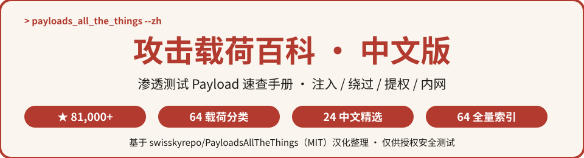
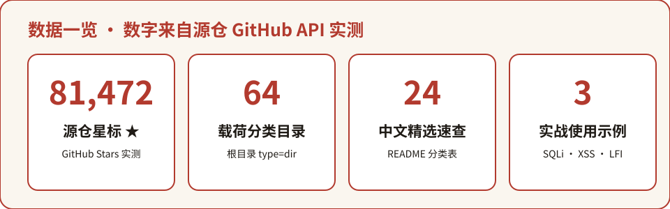
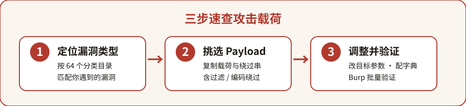

<p align="center">
  
</p>

# Payloads All The Things 中文版

> **渗透测试人员必备的「攻击载荷百科」· 中文速查版**
> 源自 GitHub 上 **81,000+ ★** 的 [swisskyrepo/PayloadsAllTheThings](https://github.com/swisskyrepo/PayloadsAllTheThings)，覆盖 **64 个载荷 / 漏洞分类目录**，本中文库精选速查 **24 类高频场景**、并给出 **全量 64 类中文索引**，是 Web 安全、注入绕过、提权与内网攻防的实战载荷手册。


---

⭐ 如果对你有帮助，点个 Star 支持中文开源

## 目录

- [这是什么？](#这是什么)
- [为什么值得收藏](#为什么值得收藏)
- [数据一览](#数据一览)
- [快速开始](#快速开始)
- [分类清单](#分类清单)
- [全量分类索引](#全量分类索引)
- [完整数据](#完整数据)
- [常见问题 FAQ](#常见问题-faq)
- [参与贡献](#参与贡献)
- [致谢](#致谢)
- [许可声明](#许可声明)

---

## 这是什么？

**Payloads All The Things 中文版** 是对全球最知名的开源渗透测试载荷仓库 [PayloadsAllTheThings](https://github.com/swisskyrepo/PayloadsAllTheThings)（作者 Swissky，Twitter [@pentest_swissky](https://twitter.com/pentest_swissky)）的中文二次开发项目。

源项目自述为 *"A list of useful payloads and bypasses for Web Application Security and Pentest/CTF"* —— 一份面向 Web 应用安全、渗透测试与 CTF 的实用 **载荷与绕过技巧清单**。每个章节（漏洞分类）都包含三件套：

- **README.md**：漏洞原理 + 利用步骤 + 多条可直接复用的 Payload；
- **Intruder**：给 Burp Suite Intruder 用的字典 / 数据集；
- **Images / Files**：配合说明的截图与参考文件。

源项目还是 "AllTheThings" 家族的一员，同系列还有面向 AD / 内网的 [InternalAllTheThings](https://swisskyrepo.github.io/InternalAllTheThings/) 与硬件 / IoT 方向的 [HardwareAllTheThings](https://swisskyrepo.github.io/HardwareAllTheThings/)。

**中文版做了什么：**
- 🗂️ 把源仓 **64 个载荷分类目录** 全部翻译为中文名，整理成 [payloads-index.md](payloads-index.md) 全量索引；
- ⚡ 在本 README 精选 **24 类高频场景**，配中文一句话用途速查表；
- 📖 提炼 SQL 注入 / XSS 绕过等典型使用姿势，让中文安全从业者「查得到、看得懂、用得上」。

## 为什么值得收藏

- 🎯 **实战导向**：不是理论教材，而是「遇到什么漏洞 → 拿什么 Payload → 怎么绕过」的即查即用清单；
- 🧰 **覆盖面广**：64 个分类横跨 Web 注入、客户端、认证授权、反序列化、请求走私、竞态条件、SSRF、SSTI 等主流攻防面；
- 🆓 **完全免费**：源项目采用 MIT 许可，可自由学习、使用与改造；
- 🔄 **社区活跃**：全球安全研究者持续提交新 Payload 与绕过技巧，仓库长期维护；
- 🇨🇳 **中文友好**：全量中文分类索引 + 精选速查表，英文文档读起来不再吃力。

## 数据一览

<p align="center">
  
</p>

> 数字全部来自源仓 GitHub API 实际抓取统计（根目录列表 + 仓库元信息，核实日期 2026-10-05）。

## 快速开始

### 三步上手

<p align="center">
  
</p>

1. **定位漏洞类型**：在下方分类清单或 [全量索引](payloads-index.md) 中，按你遇到的漏洞（如 SQL 注入、XSS）找到对应分类；
2. **挑选 Payload**：进入源仓对应目录的 README，复制可复用的载荷 / 绕过字符串；
3. **按场景调整**：把 Payload 里的目标地址、参数、闭合符号改成你的实际测试点，配合 Burp Intruder 字典批量验证。

> ⚠️ 仅在**已获得书面授权**的渗透测试、众测或自有靶场 / CTF 中使用。

### 示例一：SQL 注入 —— 先判断、再利用

源仓 `SQL Injection` 章节的经典思路：先用布尔条件判断注入点是否存在，再用 UNION 联合查询取数据。

```text
# 1) 判断注入：加引号 / 布尔条件，观察页面是否变化
page.asp?id=1' OR 1=1 --        # 预期：页面正常（恒真）
page.asp?id=1' AND 1=2 --       # 预期：页面异常（恒假）

# 2) 联合查询：猜列数后回显用户名密码
1' UNION SELECT username, password FROM users --
```

布尔盲注时，源仓给出逐字符爆破的标准姿势：

```text
item?id=1 AND ASCII(SUBSTRING(@@hostname, 1, 1)) > 64 --
# 通过不断调整 > 后的数字，根据页面是否变化逐位猜出数据
```

### 示例二：XSS —— 过滤绕过思路

源仓 `XSS Injection` 章节强调：测试时用 `alert(document.domain)` 而不是 `alert(1)`，才能确认脚本实际执行的域；遇到关键词被过滤时，用「拆分标签」等技巧绕过：

```text
# 标准回显测试（确认执行域，而非只弹 1）
<script>alert(document.domain)</script>

# 标签关键词被过滤时的拆分绕过
<scr<script>ipt>alert('XSS')</scr<script>ipt>

# 闭合属性后注入
"><script>alert('XSS')</script>
```

### 示例三：文件包含 / 目录穿越 —— 读敏感文件

源仓 `Directory Traversal` 与 `File Inclusion` 章节的典型载荷，通过 `../` 跳出 web 根目录读取服务器文件：

```text
?page=../../../../etc/passwd
?file=....//....//....//windows/win.ini      # 过滤 ../ 时的等价变形
```

> 更多分类与载荷，见 [payloads-index.md](payloads-index.md) 与源仓对应目录。

## 分类清单

精选 **24 个高频载荷分类**（完整 64 类见 [payloads-index.md](payloads-index.md)）：

| 中文分类 | 英文原名 | 一句话用途 |
| --- | --- | --- |
| SQL 注入 | SQL Injection | 注入 SQL 语句拖库 / 绕登录 / 盲注 |
| 跨站脚本 XSS | XSS Injection | 注入脚本在受害者浏览器执行 |
| 命令注入 | Command Injection | 拼接操作系统命令执行任意指令 |
| XML 外部实体注入 XXE | XXE Injection | XML 外部实体读文件 / 打 SSRF |
| 服务端请求伪造 SSRF | Server Side Request Forgery | 诱导服务器发起请求访问内网 |
| 服务端模板注入 SSTI | Server Side Template Injection | 模板引擎注入实现 RCE |
| 不安全反序列化 | Insecure Deserialization | 反序列化 gadget 链导致 RCE |
| 文件包含 LFI/RFI | File Inclusion | 本地 / 远程包含恶意文件 |
| 目录穿越 | Directory Traversal | `../` 遍历读取服务器任意文件 |
| 不安全文件上传 | Upload Insecure Files | 绕过校验上传可执行 Webshell |
| NoSQL 注入 | NoSQL Injection | MongoDB 等 NoSQL 查询注入绕过 |
| LDAP 注入 | LDAP Injection | 注入 LDAP 过滤器绕过认证 |
| XPath 注入 | XPATH Injection | 注入 XPath 查询遍历 XML 数据 |
| JWT 令牌攻击 | JSON Web Token | 弱密钥 / 算法混淆 / 未校验绕过 |
| 跨站请求伪造 CSRF | Cross-Site Request Forgery | 诱导已登录用户发起非预期请求 |
| 开放重定向 | Open Redirect | 可控跳转用于钓鱼与令牌窃取 |
| CORS 跨域配置错误 | CORS Misconfiguration | 错误跨域策略导致数据泄露 |
| 原型链污染 | Prototype Pollution | 污染原型引发 XSS / RCE |
| 请求走私 | Request Smuggling | 污染代理间请求绕过前端防护 |
| 竞态条件 | Race Condition | 并发竞争突破一次性 / 限额逻辑 |
| CSV 公式注入 | CSV Injection | 导出表格时注入公式触发执行 |
| CRLF 注入 | CRLF Injection | 注入回车换行篡改响应头 |
| 业务逻辑漏洞 | Business Logic Errors | 破坏业务流程的逻辑缺陷 |
| 不安全直接对象引用 IDOR | Insecure Direct Object References | 越权访问 / 操作他人对象数据 |

## 全量分类索引

📄 **[payloads-index.md](payloads-index.md)** — 收录源仓全部 **64 个载荷分类目录** 的中文名称 + 英文原名 + 一句话用途 + 源目录直达链接，按字母序排列，即查即走。

## 完整数据

- 📦 源仓库：[swisskyrepo/PayloadsAllTheThings](https://github.com/swisskyrepo/PayloadsAllTheThings)（默认分支 master，MIT License）
- 🌐 在线文档站（替代阅读视图）：<https://swisskyrepo.github.io/PayloadsAllTheThings/>
- 📖 源 README：[raw.githubusercontent.com/.../README.md](https://raw.githubusercontent.com/swisskyrepo/PayloadsAllTheThings/master/README.md)
- 📜 源许可文件：[LICENSE](https://github.com/swisskyrepo/PayloadsAllTheThings/blob/master/LICENSE)
- 📚 学习书单与视频：[BOOKS.md](https://github.com/swisskyrepo/PayloadsAllTheThings/blob/master/_LEARNING_AND_SOCIALS/BOOKS.md) / [YOUTUBE.md](https://github.com/swisskyrepo/PayloadsAllTheThings/blob/master/_LEARNING_AND_SOCIALS/YOUTUBE.md)

## 常见问题 FAQ

**Q1：这些 Payload 能直接复制去打真实目标吗？**
请务必先获得**书面授权**。本仓库仅用于授权渗透测试、众测、自有靶场与 CTF 练习。未经授权对他人系统使用任何载荷均属违法行为。

**Q2：为什么分类名和我印象里的不太一样？**
源仓以根目录文件夹组织内容，本仓库的 64 个分类名严格对应源仓真实目录（经 GitHub API 抓取统计），中文名为本地翻译整理，技术细节请以源仓英文 README 为准。

**Q3：星数和分类数是多少？怎么来的？**
源仓星标 **81,472**（GitHub API 实测）；根目录共 67 个目录，排除 `.github`、`_LEARNING_AND_SOCIALS`、`_template_vuln` 三个内部目录后，载荷分类目录为 **64** 个。统计口径见 [THIRD_PARTY_NOTICES.md](THIRD_PARTY_NOTICES.md)。

**Q4：每个分类目录里都有什么？**
统一四件套：README.md（漏洞原理 + 利用 + 载荷）、Intruder（Burp 字典）、Images（截图）、Files（参考文件）。想新写一个漏洞章节，可以用源仓的 `_template_vuln` 模板。

**Q5：中文版和源仓库是什么关系？**
本仓库不修改源项目的任何载荷内容，只做**中文分类翻译、索引整理与导读**。技术原文、PoC 与更新都以源仓库为准；本仓库代码与文档采用 MIT 许可。

## 参与贡献

- 🐛 发现中文分类翻译有误、或想补充某个分类的中文说明：提 Issue；
- 🗂️ 补充 / 修正 [payloads-index.md](payloads-index.md) 中分类的中文用途描述：Fork 后提 PR；
- 📝 分享你在实战中验证过的绕过技巧：欢迎在 Issue 区讨论。

## 致谢

- 特别感谢 **Swissky**（[@pentest_swissky](https://twitter.com/pentest_swissky)）与众多全球贡献者共同建设的 [PayloadsAllTheThings](https://github.com/swisskyrepo/PayloadsAllTheThings)；
- 感谢 SerpApi、ProjectDiscovery、VAADATA 等对源项目的赞助；
- 感谢 AllTheThings 家族（InternalAllTheThings / HardwareAllTheThings）；
- 感谢每一位 Star 本仓库、支持中文安全社区的你 🌟

## 许可声明

- 本仓库代码与中文文档：**MIT License**，Copyright (c) 2026 zieang88888（见 [LICENSE](LICENSE)）；
- 源项目 [swisskyrepo/PayloadsAllTheThings](https://github.com/swisskyrepo/PayloadsAllTheThings)：**MIT License**，Copyright (c) 2019 Swissky；
- 第三方声明与完整署名见 [THIRD_PARTY_NOTICES.md](THIRD_PARTY_NOTICES.md)。


## 姊妹项目

中文开源矩阵，一网打尽开发者的知识库：

- [zhskills · 中文技能库](https://github.com/zieang88888/zhskills)
- [awesome-ai-tools-zh · AI 工具导航](https://github.com/zieang88888/awesome-ai-tools-zh)
- [free-programming-books-zh · 编程书籍大全](https://github.com/zieang88888/free-programming-books-zh)
- [system-design-zh · 系统设计面试](https://github.com/zieang88888/system-design-zh)
- [awesome-python-zh · Python 生态导航](https://github.com/zieang88888/awesome-python-zh)
- [ohmyzsh-zh · 终端效率神器](https://github.com/zieang88888/ohmyzsh-zh)
- [llm-course-zh · LLM 课程导航](https://github.com/zieang88888/llm-course-zh)
- [design-resources-for-developers-zh · 设计资源大全](https://github.com/zieang88888/design-resources-for-developers-zh)
